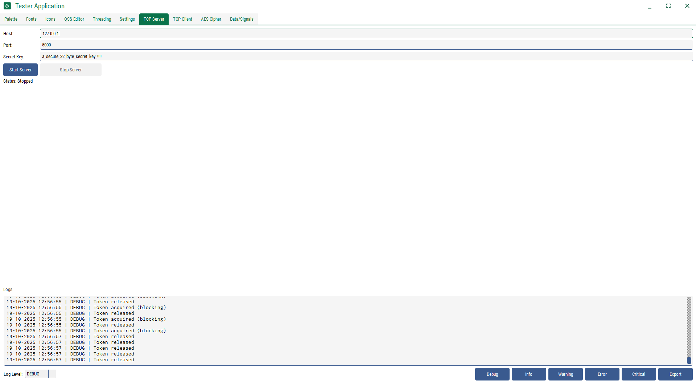

# Python Desktop Application Template
Sample reusable feature-rich template desktop application built using python and PySide6.

Screenshots:

Changelog
Version 1.0.0.2
- splash, closing screen added.
- background process added in cleanup.
- font manager class (supports google fonts as .ttf)
- style (dark/night themes, 3 colour accent system) and svg icon manager class (svg colouring, dynamic)
- tcp based backend api communication (suppot for distributed enviornments)(encrypted)
- custom titlebar with grips, drag etc.

Version 1.0.0.0
Available Features as of now
- Modular Archetecture
- Configuration Manager with json configuration saving (static/ user settings).
- Advanced logger class with events
- Background worker (Thread pooling)

NB: Initial development phase

## Developer Tools

### Tester Application (`common/tester/tester_app.py`)

The Tester Application is a comprehensive utility designed to provide a live testing environment for the various components of this framework. It allows developers to interact with and visualize the behavior of managers, UI components, and backend services in real-time.

Here's a breakdown of its features, organized by tab:

#### Palette
Visualize the entire color palette generated by the `StyleManager`. Dynamically change the application's theme (light/dark) and the accent, support, and neutral colors. New colors can be added using a color picker.

#### Fonts
Previews all fonts loaded by the `FontManager`. Allows you to change the font size for each preview and apply any font application-wide to see its effect instantly.

#### Icons
A powerful browser for all SVG icons managed by the `IconManager`. Features include:
- Asynchronous loading to handle large icon sets without freezing the UI.
- Live search/filtering.
- Dynamic re-coloring of all icons based on the current theme.
- Controls to change the preview size.
- Ability to load new icons into the project from the local filesystem.

#### QSS Editor
A live Qt StyleSheet (QSS) editor.
- Comes pre-loaded with a comprehensive default theme.
- Supports dynamic color keys (e.g., `<accent>`, `<bg>`) which are replaced with colors from the current theme palette upon applying.
- Supports dynamic icon embedding using a custom `url(icon:icon-name)` and path-based syntax.

#### Settings
A UI for viewing and editing all user and static settings from the `configuration.json` file.
- Settings are automatically categorized into tabs based on their `group` property.
- Supports various input types like text, dropdown, file browse, and folder browse.
- Allows for the creation of new user settings and the deletion of existing ones.

#### Threading
Test the `ThreadManager` for handling background tasks.
- Run asynchronous coroutines and blocking functions in a thread pool.
- Test token-limited concurrency to manage resource-intensive tasks.
- Reconfigure the thread pool's `max_workers` and `max_tokens` at runtime.

#### TCP Server & Client
Test the encrypted TCP communication layer.
- Start a `BackendServer` on a specified host/port.
- Use the `BackendClient` to send requests to the server and view the JSON response.

#### AES Cipher
A simple utility to test the `AESCipher` class for encrypting and decrypting strings with a given key.

#### Data/Signals
Test the `AppData` singleton for global state management and inter-widget communication.
- Test progress bar updates.
- Emit and listen for global signals like `style_changed`.
- Interact with the shared key-value data store.

